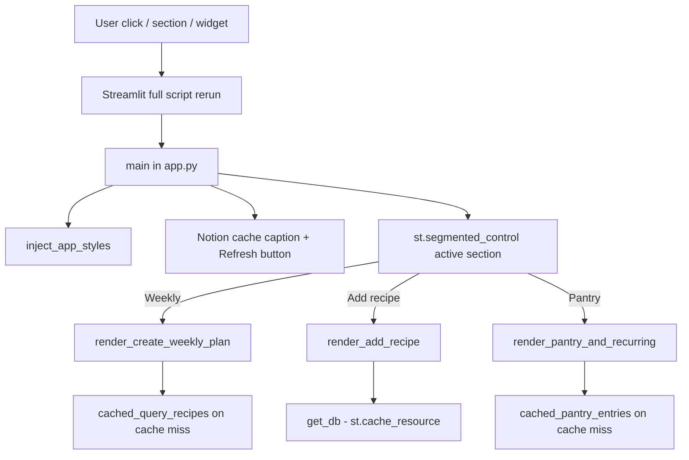

# Streamlit UI performance research

**Issue:** [#128](https://github.com/rachelgramlich/grocery-wizard/issues/128)
**Scope:** Research and recommendations only (implementation staged in follow-up issues).
**Primary code:** `src/grocery_wizard/ui/app.py` (thin entry: page config, styles, Notion cache controls, segmented navigation).

## Executive summary

Everyday slowness (buttons, navigation) is dominated by Streamlit’s **full-script rerun** model and **Notion round-trips** when caches miss. The UI has moved away from a monolithic `app.py`: tab bodies live under `ui/sections/`, the **Create weekly plan** flow is split across `ui/sections/weekly_plan/` (plan entry, recipe review, grocery wizard), and **`st.segmented_control`** only runs **one** section per interaction instead of all tabs at once.

**Phase 1** work (cached Notion reads via `ui/notion_cache.py`, explicit invalidation, single-section navigation) is largely in place. Remaining gains are mostly **DOM weight**, **fragment-scoped reruns** inside heavy sections, and **deduping** recipe fetches within a single weekly-plan rerun.

**Recommended path:** Stay on Streamlit. Measure with the sidebar “Last full recipe load” caption and `Refresh from Notion`. Revisit stack choice only if warm-cache P95 rerun time stays unacceptable after further section-level optimization.

| Phase | Focus | Rough effort | Expected impact |
| --- | --- | --- | --- |
| **1** | Cache + dedupe Notion reads; lazy tabs | 2–4 days | High — often cuts rerun time by 50–90% when Notion-bound |
| **2** | Split large sections, fragments, slimmer widgets | 3–5 days | Medium — faster Python + less DOM work |
| **3** | Instrumentation, TTL/invalidation policy, optional local snapshot | 2–3 days | Medium — predictable freshness vs speed |
| **4+** | Alternative UI stack or SPA rewrite | weeks–months | High UX ceiling; high migration cost |

---

## How the UI runs today

### Streamlit rerun model

- Any widget change triggers a **top-to-bottom rerun** of `app.py` (and imported section code for the **active** segment only).
- **`st.segmented_control`** (replacing always-on `st.tabs()`) gates which `render_*` runs: inactive sections are **not** executed on that rerun.
- `st.rerun()` is still used after many actions (save, plan build, grocery steps), so users pay a full script rerun cost repeatedly.

### Notion / I/O on interaction

| Call site | When it runs | Notes |
| --- | --- | --- |
| `get_db()` | Section renders that need Notion | `@st.cache_resource` — client + schema load once per process |
| `cached_query_recipes()` | Weekly plan (meals + grocery) | `@st.cache_data` keyed by `notion_cache_generation`; miss runs full pagination |
| `cached_pantry_entries()` | Pantry & recurring section | Cached pantry list; invalidated with recipes/plans on writes or Refresh |
| `cached_saved_plans()` | Weekly plan entry (saved mode) | Cached saved meal plans |
| `find_by_link()` (Add recipe) | Preview | Should prefer Notion filter over full scan (Phase 1 follow-up) |
| `ensure_saved_weekly_plan()` / writes | Save plan, create grocery list | Bumps cache via `invalidate_notion_cache()` when new plan rows are created |

Recipe count scales linearly on **cache miss**: each uncached `query_recipes()` paginates until `has_more` is false (`integrations/notion.py`).

### Other costs

- **Large section modules:** weekly plan still builds many widgets when that segment is active — candidate for `@st.fragment` per step.
- **CSS** injected once per rerun via `ui/styles.py` (lighter than the original inline block, but still every run).
- **Copy / download** helpers on the final grocery view add text areas and download buttons.
- **Session state** for ingredient index, grocery result, and review widgets adds branching on each weekly-plan rerun.

### What is already optimized

- `@st.cache_resource` on `get_db()`.
- `ui/notion_cache.py`: cached recipes, pantry, saved plans + **Refresh from Notion** (`invalidate_notion_cache()`).
- **Single active section** per rerun (`app.py` + `ui/tabs.py`).
- **Modular sections:** `ui/sections/add_recipe.py`, `pantry_recurring.py`, `weekly_plan/` (plan entry, recipe review, grocery wizard).
- Ingredient index for meal planning cached in session state keyed by recipe-set fingerprint.
- Grocery result cached in `st.session_state.grocery_result` until the meal plan changes.

---

## Root-cause hypotheses (ranked)

1. **Notion round-trips on cache miss (high confidence)**  
   Weekly segment still calls `cached_query_recipes()` every rerun; a miss or post-write invalidation re-fetches all recipes.

2. **Inactive sections skipped (addressed for top-level nav)**  
   Pantry work no longer runs when the user is only on Weekly plan, and vice versa.

3. **Network + serialization (medium confidence)**  
   Notion API latency blocks the script thread on cache misses.

4. **Large widget tree / DOM updates (medium confidence)**  
   Meal slots, review expanders, and pantry lists remain heavy when their section is active.

5. **Cold start / deployment (low–medium confidence)**  
   First load after idle adds startup; distinct from “every click feels slow.”

6. **Duplicate work inside one weekly-plan rerun (medium confidence)**  
   Multiple paths may still touch `cached_query_recipes()` in the same run (review build, meal links, dev jumps).

---

## Profiling plan (before/after each phase)

### Quick manual timing

Use the in-app caption **“Last full recipe load from Notion: X.XXs”** (populated on cache misses ≥ ~50ms) plus temporary timing around suspect blocks during development.

Use Streamlit **Settings → Run on save** off while measuring so saves do not skew results.

### Structured options

| Tool | Use |
| --- | --- |
| `cProfile` / `py-spy` on `streamlit run ...` | Find Python hotspots (parsing, grouping, Notion client) |
| Browser DevTools → Network | See rerun WebSocket latency vs idle |
| Streamlit `st.cache_data` stats (logging) | Verify cache hit rate after changes |
| Optional: `@st.fragment` run counts | Confirm inactive regions skip work |

### Success metrics (suggested)

- **P95 rerun time** with a warm cache and typical recipe count (e.g. 150, 400 rows).
- **Notion API calls per rerun** (target: 0 for pantry-only edits when Weekly segment inactive; 0–1 cached reads for weekly-only edits with warm cache).
- **Subjective:** section switch and primary buttons feel "instant" (<300ms local) or "acceptable" (<1s remote Notion).

---

## In-app refactor options (Streamlit)

### A. Cache Notion reads with explicit invalidation (Phase 1 — **largely shipped**)

- Implemented in `ui/notion_cache.py` with `invalidate_notion_cache()` on writes and **Refresh from Notion**.
- Remaining: audit all write paths; ensure `find_by_link` uses a **Notion filter** instead of scanning all recipes in Python.

**Tradeoffs:** Stale data if invalidation misses a path; must audit all write paths.
**Effort:** ~1 day remaining. **Impact:** High on miss path.

### B. Lazy tab / section execution (Phase 1 — **shipped at top level**)

- **`st.segmented_control`** in `app.py` runs one section renderer per rerun.
- Optional next step: **`@st.fragment`** inside weekly plan steps (meals vs grocery vs review).

**Tradeoffs:** Fragments have edge cases with cross-tab state.
**Effort:** 1–2 days for fragments. **Impact:** Medium–high inside weekly plan.

### C. Single recipe fetch per rerun (Phase 1 — partial)

- Weekly flow should pass one `all_recipes` list through review and grocery build where possible.
- Dev jump tools still call `db.query_recipes()` directly in places — candidate to unify on `cached_query_recipes`.

**Effort:** ~1 day. **Impact:** Medium.

### D. Modularize UI (Phase 2 — **in progress**)

- Thin `app.py`; sections under `ui/sections/`; weekly plan split into plan entry, recipe review, grocery wizard modules.
- Easier to apply fragments and unit-test pure helpers.

**Effort:** ongoing. **Impact:** Maintainability; indirect perf via smaller reruns.

### E. Reduce DOM weight (Phase 2)

- Replace per-item `st.button("x")` rows with `st.data_editor` or batched forms where feasible.
- Move copy-to-clipboard to a shared static component or `st.components.v1` once.
- Load CSS from static/ or theme instead of inline markdown every run.

**Effort:** 2–4 days. **Impact:** Medium on large pantry lists.

### F. Background refresh / optimistic UI (Phase 3)

- Show last cached recipes immediately; refresh in background on interval or on focus.
- Requires careful UX for conflicts when Notion changed elsewhere.

**Effort:** 3–5 days. **Impact:** High perceived speed; more complex.

### G. Local read replica (Phase 3)

- Periodic CLI job (`dev refresh-recipe-cache`) writes JSON snapshot; UI reads local file and optionally syncs.
- Aligns with existing CLI-first workflows in this repo.

**Tradeoffs:** Operational step; freshness policy needed.
**Effort:** 3–4 days. **Impact:** High for large DBs.

---

## Alternative Python UI stacks

All can reuse existing `src/grocery_wizard/*` domain logic (planning, grocery_list, Notion integrations).

| Stack | Fit | Pros | Cons | Effort to reach parity |
| --- | --- | --- | --- | --- |
| **Streamlit + fragments/cache** | Best short-term | Keep current UX; smallest diff | Rerun model limits ceiling | Days |
| **NiceGUI** | Good | Fast reactive UI; still Python | Different component model; hosting | 1–2 weeks |
| **Reflex** | Moderate | Full web app in Python | Heavier framework; build pipeline | 2–4 weeks |
| **FastAPI + HTMX** | Good | Fine-grained requests; no full rerun | Write HTML/templates | 2–3 weeks |
| **FastAPI + React/Vue SPA** | Long-term | Best interaction latency | Two languages; API layer | 1–3 months |
| **Gradio** | Poor fit | Quick demos | Awkward for multi-tab planner UX | N/A |
| **Panel / Dash** | Moderate | Reactive plots + apps | Learning curve; less common here | 2–3 weeks |

**Compatibility note:** Project depends on `streamlit>=1.39` and documents `just grocery-ui`. Any migration should keep CLI paths unchanged.

---

## Heavier options (non-Python front end)

| Approach | When it makes sense | Effort |
| --- | --- | --- |
| **REST/GraphQL API + SPA** | Team wants mobile-quality UX or offline | 2–4 months |
| **Tauri/Electron shell** | Desktop-only power users | 1–2 months + API |
| **Rewrite in Next.js etc.** | UI becomes product surface | 3+ months |

Justification threshold: Phase 1–3 fail metrics **and** UI is a primary daily driver for multiple users — not yet required for a personal Notion-backed tool if caching fixes land.

---

## Recommended roadmap

1. **Measure** with in-app recipe load caption + count Notion calls on a representative DB size.
2. **Phase 1 (mostly done):** verify invalidation on all write paths; Notion-filtered `find_by_link`; dedupe fetches inside weekly plan.
3. **Phase 2:** `@st.fragment` for weekly-plan steps; slim pantry list UI; externalize CSS further.
4. **Phase 3:** document TTL policy, optional JSON snapshot for offline-speed reads.
5. **Re-evaluate stack** only if P95 rerun > ~1s after Phase 1–2 with warm cache.

---

## Follow-up implementation issues (tracking)

| Phase | GitHub | When to implement |
| --- | --- | --- |
| **1** — cache, lazy tabs, dedupe fetches | [#144](https://github.com/rachelgramlich/grocery-wizard/issues/144) | Verify remaining gaps (find_by_link, dev jump queries) |
| **2** — modularize app, lighten DOM | [#145](https://github.com/rachelgramlich/grocery-wizard/issues/145) | Weekly plan split landed; fragments + DOM next |
| **3** — freshness policy, local snapshot | [#146](https://github.com/rachelgramlich/grocery-wizard/issues/146) | Only if Phase 1+2 done and latency still unacceptable with warm cache |

---

## References in repo

- Entry point: `src/grocery_wizard/ui/app.py` — `main()`, segmented navigation, cache refresh
- Notion cache: `src/grocery_wizard/ui/notion_cache.py`
- Weekly plan UI: `src/grocery_wizard/ui/sections/weekly_plan/` (`plan_entry.py`, `recipe_review.py`, `grocery_wizard.py`, `flow.py`)
- Notion pagination: `src/grocery_wizard/integrations/notion.py` — `query_recipes()`
- Pantry load: `cached_pantry_entries()` in `notion_cache.py`; `render_pantry_and_recurring` in `sections/pantry_recurring.py`
- Grocery build: `src/grocery_wizard/ui/grocery_flow.py`, `shopping/grocery_list.py`
- Streamlit run: `just grocery-ui` / `src/grocery_wizard/README.md` § Streamlit UI
